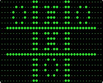

<link rel="stylesheet" href="img/md_style.css">

# Videojuegos y Motores

En este tema veremos brevemente qué es un videojuego, cómo surgen y su evolución así como los motores de videojuegos que existen actualmente y una justificación de nuestra elección.

## Origen y Evolución de los Videojuegos

Antes de nada, para saber el origen y cómo surgen los videojuegos vamos a ver qué es un videojuego. Seguramente todos sabemos reconocer un videojuego actual pero si nos remontamos al origen, las líneas entre qué es y qué no es un videojuego no están tan claras.

Hay muchas definiciones de videojuego y estas varían dependiendo del campo de estudio. Algunos autores, por ejemplo definen el videojuego como una película interactiva. Esto, para algunos, puede ser cierto pero no para otros como un juego de estrategia por ejemplo. Hay otras descripciones más específicas como esta: "Un videojuego es un juego electrónico en el que una o más personas interactúan por medio de un controlador, con un dispositivo que muestra imágenes de vídeo".

A nosotros realmente la definición formal de videojuego no nos interesa tanto, de hecho, existen videojuegos en los que no se visualiza nada por la pantalla y se juega solamente basándose en los sonidos. Esta definición, no nos valdría en este caso.

Diremos por tanto que un videojuego es un juego electrónico.

### Primeros videojuegos

Hay diferentes opiniones acerca de cual fue el primer videojuego, como ya hemos visto, todo depende de la definición que demos. Tal y como lo hemos definido nosotros, los primeros ejemplos los encontramos en el [OXO](https://es.wikipedia.org/wiki/OXO) (1952) y el [Tennis for Two](https://es.wikipedia.org/wiki/Tennis_for_Two) (1958).

| OXO | Tennis for Two |
| -- | -- |
|  |  |

### Primeros videojuegos comerciales y Empresas

Ralph Baer lanza [Magnavox Odyssey](https://es.wikipedia.org/wiki/Magnavox_Odyssey) en 1972, esta es la primera videoconsola doméstica comercial.

Gracias a esto, un grupo de ingenieros fundan [Atari](https://es.wikipedia.org/wiki/Atari) y crean uno de los juegos más conocidos para su propia máquina recreativa, [Pong](https://es.wikipedia.org/wiki/Pong). A partir de aquí, la compañía se dedica a sacar videoconsolas domésticas.

En 1978 aparece [Space Invaders](https://en.wikipedia.org/wiki/Space_Invaders), que gana terreno y llega tanto a máquinas arcade como a consolas domésticas.

Con el tiempo, siguen apareciendo videojuegos que conocemos incluso a día de hoy.

Es el caso de [Pacaman](https://en.wikipedia.org/wiki/Pac-Man) en 1980 y [Donkey Kong](https://es.wikipedia.org/wiki/Donkey_Kong_(videojuego)) en 1981 por Nintendo.

Despues de algunos problemas en Atari, cuantro de los programadores que trabajaban allí acaban abandonando la empresa y forman [Activision](https://www.activision.com/es/). Este será el primer distribuidor independiente para la consola de Atari.

| Pong | Space Invaders | Pacman | Donkey Kong |
| -- | -- | -- | -- |
|  |  |  |  |

### La caída

La industria del videojuego se va consolidando y parece que los ingresos de las empresas solo hacen que aumentar. Debido a estas expectativas, se empieza a saturar el mercado con juegos que no están a la altura y comienza a disminuir la venta de juegos y la confianza en los proveedores.

Los ingresos desaparecen hasta el punto de que Warner, que había comprado Atari algunos años atras acaba vendiendo la empresa. Todo este cambio repentino tiene consecuencias para muchas otras empresas de ordenadores y videojuegos que acaban quebrando.

Después de esto empiezan a surgir dudas sobre si la industria de los videojuegos realmente tiene futuro.

Afortunadamente en 1983 surge la [Famicom](https://es.wikipedia.org/wiki/Famicom_Disk_System) o [N.E.S.](https://es.wikipedia.org/wiki/Nintendo_Entertainment_System) para el mercado estadounidense.

Esta videoconsola es un empujón para la industria que empieza a recuperar la normalidad.

| Magnavox Odyssey | Pong Arcade | N.E.S. |
| -- | -- | -- |
|  |  | 

> Los gráficos que vemos en la Magnavox Odyssey no son gráficos 'reales' ya que era una consola muy básica. Estos, son plantillas de plástico que se colocaban encima de la televisión para hacer el juego más entretenido. La consola no era capaz ni de almacenar puntuaciones.

> Si os parece interesante y quereis ampliar sobre este tema, no dudeis en ver estos vídeos, cuentan la historia de la industria de los videojuegos entre los años 1972 y 1998 de una forma visual y amena. [Parte I](https://www.youtube.com/watch?v=KRRfb-pSZy8&list=RDCMUCv05qOuJ6Igbe-EyQibJgwQ), [Parte II](https://www.youtube.com/watch?v=uSdPMRV_Q3w&list=RDCMUCv05qOuJ6Igbe-EyQibJgwQ) y [Parte III](https://www.youtube.com/watch?v=RID-JDJ-_Hw&list=RDCMUCv05qOuJ6Igbe-EyQibJgwQ).

## Motores

Un **Motor de Videojuegos** es una herramienta que nos facilita la creación de videojuegos abstrayéndonos de la implementación compleja de aspectos comunes.

En los videojuegos en general, existen ciertos aspectos y técnicas que son comunes a la gran mayoría de estos, un ejemplo de esto puede ser el renderizado 3D, las físicas y colisiones, las animaciones o la reproducción de sonidos.

Todo esto, aunque parezca básico, si cada vez que queremos hacer un videojuego tenemos que implementarlo, nos llevaría mucho tiempo y conocimiento. Como solución a este problema, poco a poco han ido surgiendo herramientas o librerías que nos permiten abstraernos de la programación a bajo nivel de estas técnicas.

La culminación de esto, son los motores de videojuegos, estos nos permiten estructurar y crear nuestros proyectos así como utilizar funcionalidades que si las tuviésemos que implentar por nosotros mismos, probablemente no lo conseguiríamos. Recordemos que estos, los programan expertos que saben perfectamente cómo funcionan las cosas, por lo que además, aplican técnicas de optimización punteras que nosotros ni nos planteamos. Esta es una de las razones por las que a veces, aunque pensemos que un motor de videojuegos, como tiene tantas cosas, va a relentizar nuestro código, acaba siento completamente al contrario.

Existen motores de todo tipo, no solo lo más grandes lo son, estos, están diseñados para abarcar la gran mayoría de géneros de videojuegos, pero hay otros más pequeños que también podemos considerarlos motores. Hay algunos que ni siquiera tienen interfaz gráfica, otros que tienen como objetivo abarcar solo un género y algunos que buscan simplificar las cosas para que no se necesite ni saber programar. Obviamente, en estos últimos, las cosas que podemos hacer están muy limitadas.

Podemos ver una extensa [lista](https://en.wikipedia.org/wiki/List_of_game_engines) con los motores que existen, desde los más básicos hasta los más punteros.

Para el curso de especialización tenemos que elegir uno de estos motores, no hay ninguno mejor que otro, algunos tienen unas ventajas e inconvenientes y otros otras.

Los motores más populares y utilizados a día de hoy son [Unity](https://unity.com/es), [Unreal](https://www.unrealengine.com) y [Godot](https://godotengine.org/).

Nosotros hemos elegido **Unity**. A continuación veremos algunas de las ventajas e inconvenientes que tienen estos motores.

Lo primero a tener en cuenta es que el motor que escojamos tiene que ser de propósito general, cuantas menos limitaciones tenga mejor. Con esto ya descartamos algunos populares como [Game Maker](https://gamemaker.io/es/gamemaker).

---

### Unity

Es imprescindible mirar a las empresas, actualmente Unity es si no el que más, uno de los motores más populares y que más demandan las empresas, esto es un gran punto a favor, ya que nos aseguramos que no es algo obsoleto.

A parte, gracias también a su popularidad, existe una amplia comunidad y muchos tutoriales, con lo que es mucho más fácil resolver nuestras dudas o bugs en foros o encontrar videos que nos ayuden a entender mejor cómo funciona todo.

Eso, sin contar la propia documentación de Unity claro. Al ser una herramienta consolidada, tiene una documentación acabada para la gran mayoría de las funcionalidades, recordemos que son herramientas en constante desarrollo y hay partes que están en proceso de documentación aún. Es el caso de [Unity Netcode](https://docs-multiplayer.unity3d.com/) por ejemplo, que es una nueva solución de Unity para los juegos multijugador.

Unity cuenta con una versión gratuita que podremos usar siempre que no excedamos unas ganancias definidas. [Comparación planes Unity](https://store.unity.com/compare-plans).

Web: https://unity.com/es

---

### Unreal Engine

Unreal Engine es una herramienta muy utilizada que destaca por su **Alto rendimiento** y sus **Gráficos avanzados** gracias a ([Nanite](https://docs.unrealengine.com/5.0/en-US/nanite-virtualized-geometry-in-unreal-engine/)).

Es ideal para crear juegos **[Triple A](https://es.wikipedia.org/wiki/AAA_(industria_del_videojuego))**, esto es a su vez una ventaja y un inconveniente ya que no es el mejor motor para juegos pequeños. Aunque se necesita pedir acceso, el motor es [Open Source](https://www.unrealengine.com/en-US/ue-on-github) [*](#anexo).

> El vocabulario marcado con asterisco (*) se encuentra explicado en el anexo. Puedes dar click en el asterisco para ir directamente.

Web: https://www.unrealengine.com

---

### Godot

Godot es un motor relativamente nuevo caracterizado por que su desarrollo está guiado por la comunidad. Es [Open Source](https://github.com/godotengine/godot) * y podemos hacer fácilmente cambios al código de forma que podemos modificarlo para que se adapte a nuestras necesidades de desarrollo. Es totalmente gratis y sin tasas ya que el código está bajo [licencia MIT](https://es.wikipedia.org/wiki/Licencia_MIT).

Se puede programar en varios lenguajes, entre ellos [GDScript](https://docs.godotengine.org/es/stable/tutorials/scripting/gdscript/gdscript_basics.html) (parecido a python) y C#.

Hasta ahora, no ha sido el mejor motor si lo que queremos son gráficos 3D avanzados pero recientemente se ha publicado la versión 4 beta, con la que se pretende cambiar esto mudando de [OpenGL](https://www.opengl.org/) a [Vulkan](https://www.vulkan.org/).

Tiene una gran comunidad activa que va mejorando el código y la documentación así como la cantidad y calidad de los tutoriales.

Web: https://godotengine.org

---

> Cabe destacar que con el tiempo, todas estas consideraciones pueden cambiar. Otros motores destacables y que nos pueden interesar son [Cry Engine](https://www.cryengine.com/), [Lumberyard](https://aws.amazon.com/es/lumberyard/) o [Game Maker](https://gamemaker.io/es/gamemaker)

## Anexo

* [Open Source](https://es.wikipedia.org/wiki/C%C3%B3digo_abierto) o Código Abierto.