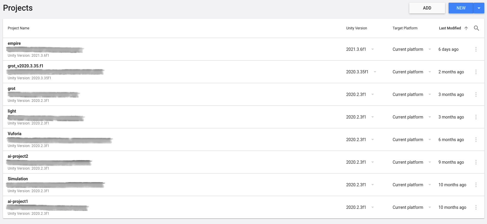
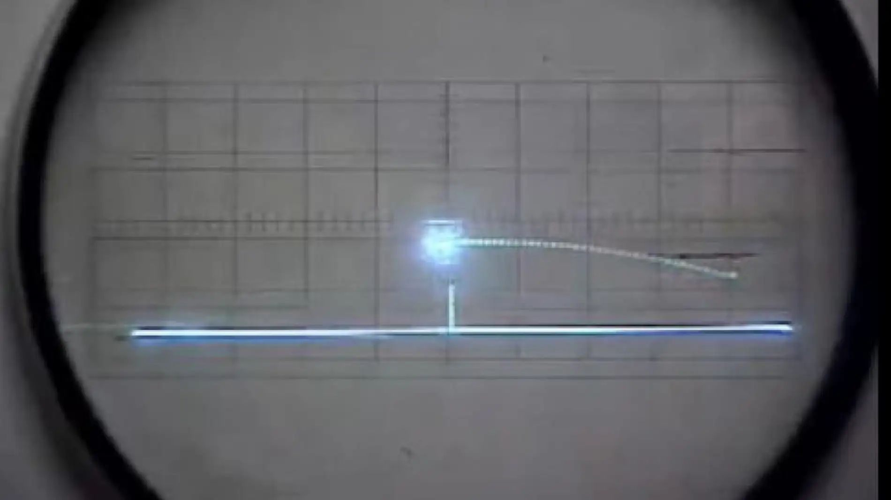

# Entorno Unity

En este tema cubriremos la instalación y configuración de Unity y veremos lo básico de este entorno de desarrollo.

## Instalación y Configuración

Podemos instalar Unity de dos formas distintas, podemos hacerlo a través del Unity HUB o podemos descargar directamente la versión de Unity.

Nosotros lo haremos a través del HUB.

### Unity HUB

Unity HUB es una herramienta oficial de Unity desde la que podemos descargar fácilmente las versiones recomendadas del motor.
Podemos controlar también qué proyecto utiliza una versión de Unity u otra, pudiendo así actualizar nuestros proyectos a versiones superiores del motor.

> Además, podemos elegir qué modulos instalar para exportar nuestros proyectos a diferentes plataformas y nos muestra también los tutoriales oficiales que el propio Unity va publicando.

En esta imagen podemos ver las versiones instaladas. Los iconos de Android, IOS y Windows que vemos que aparecen en algunas de estas, son los módulos que hay instalados en esa versión. Esto significa que los proyectos que tengamos creados en esas versiones los podemos exportar a esas plataformas.

> Los módulos se pueden instalar y desinstalar fácilmente desde el Unity HUB desde esa misma pantalla haciendo click en **More (···) > Add Modules**.
>
> Para exportar un proyecto a Android por ejemplo, necesitamos tener instalado el módulo *Android* para la versión en la que tengamos el proyecto.

> Hay versiones con marca **LTS**, esto viene de "*Long Term Support*" (Soporte a largo plazo). Con esto, Unity nos está diciendo que estas versiones van a recibir actualizaciones y parches durante un periodo largo de tiempo. No todas las versiones tienen esta etiqueta, las que no lo tienen, puede que tengan pequeños bugs que nunca se solucionan y esto puede ser un quebradero de cabeza a la hora de desarrollar.
>
> Simpre que podamos, escojeremos versiones LTS.

En esta otra imagen tenemos los proyectos, como vemos, podemos tener proyectos en diferentes versiones.

> La parte tachada es la ruta donde está guardado el proyecto.

Si nos fijamos vemos que podemos abrir un desplegable de la versión para cada proyecto.

Con este desplegable podemos cambiar la versión de proyecto pero hay que tener ojo.

Cambiar la versión de un proyecto es un proceso **irreversible** y puede que no obtengamos los resultados esperados. Unity reimportará el proyecto entero y cambiará archivos internos, dependiendo de distintos factores esto puede salir bien o mal. En el caso de que salga mal y no nos compile o tengamos resultados inesperados, tendremos un **proyecto roto**. Si intentamos cambiar a la versión que teníamos anteriormente, Unity no se acordará de que antes el proyecto estaba en otra versión, lo que hará, será intentar reimportar el proyecto dando por hecho que el proyecto está bien. Esto obiamente solo va a hacer que se rompa más todavía.

Para no cargarnos todo lo que teníamos, antes de cambiar de versión es muy importante que hagamos una copia del proyecto. Esto podemos hacerlo fácilmente clonando la carpeta en la que lo tengamos. (Recordemos que el proyecto se encuentra en la ruta que aparece).

Una opción mejor a esto, es utilizar un Sistema de Control de Veriones [*](#anexo).

> Por lo general, evitaremos cambiar de versión y en el caso de que tengamos que hacerlo, siempre es más seguro subir un proyecto de versión que bajarlo.
>
> Hay proyectos rotos que podemos arreglar fácilmente.

## Entorno de Desarrollo 

<table align="center">

<tr>
<th>OXO</th>
<th>Tennis for Two</th>
</tr>

<tr>
<td></td>
<td></td>
</tr>

</table>

## Anexo

* [Sistema de Control de Versiones](https://bitbucket.org/product/es/version-control-software)