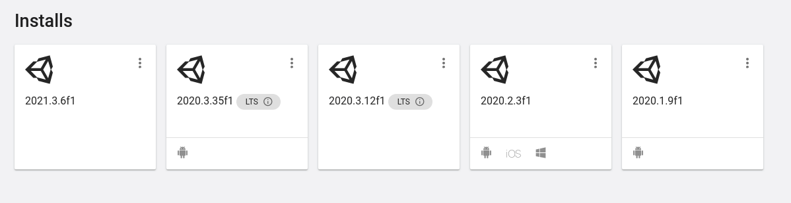
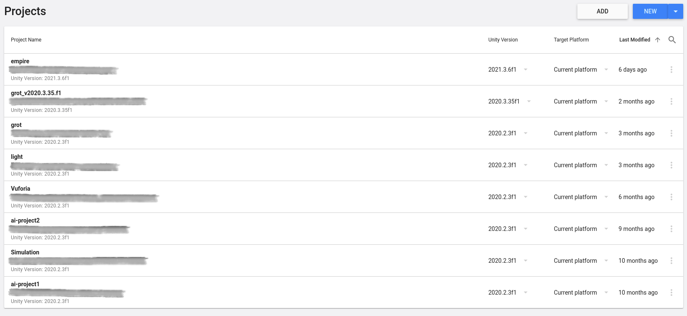
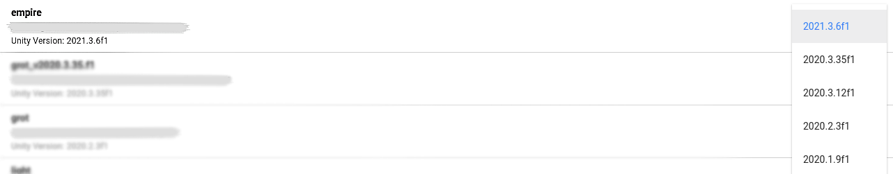
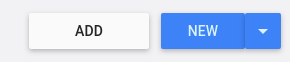
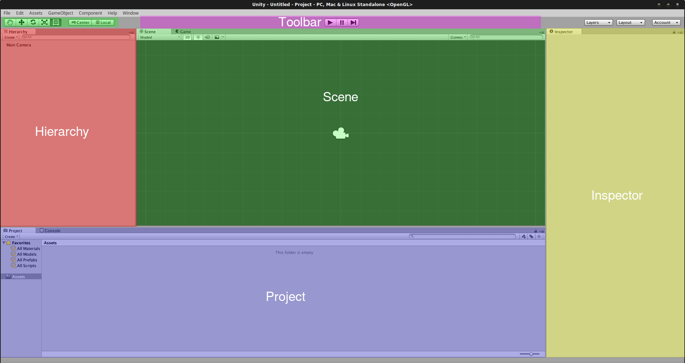

# Entorno Unity

En este tema cubriremos la instalación y configuración de Unity y veremos lo básico de este entorno de desarrollo.

## Instalación y Configuración

Podemos instalar Unity de dos formas distintas, podemos hacerlo a través del Unity HUB o podemos descargar directamente la versión de Unity.

Nosotros lo haremos a través del HUB.

### Unity HUB

Unity HUB es una herramienta oficial de Unity desde la que podemos descargar fácilmente las versiones recomendadas del motor.
Podemos controlar también qué proyecto utiliza una versión de Unity u otra, pudiendo así actualizar nuestros proyectos a versiones superiores del motor.

> Además, podemos elegir qué modulos instalar para exportar nuestros proyectos a diferentes plataformas y nos muestra también los tutoriales oficiales que el propio Unity va publicando.

En esta imagen podemos ver las versiones instaladas. Los iconos de Android, IOS y Windows que vemos que aparecen en algunas de estas, son los módulos que hay instalados en esa versión. Esto significa que los proyectos que tengamos creados en esas versiones los podemos exportar a esas plataformas.

> Los módulos se pueden instalar y desinstalar fácilmente desde el Unity HUB desde esa misma pantalla haciendo click en **More (···) > Add Modules**.
>
> Para exportar un proyecto a Android por ejemplo, necesitamos tener instalado el módulo *Android* para la versión en la que tengamos el proyecto.

> Hay versiones con marca **LTS**, esto viene de "*Long Term Support*" (Soporte a largo plazo). Con esto, Unity nos está diciendo que estas versiones van a recibir actualizaciones y parches durante un periodo largo de tiempo. No todas las versiones tienen esta etiqueta, las que no lo tienen, puede que tengan pequeños bugs que nunca se solucionan y esto puede ser un quebradero de cabeza a la hora de desarrollar.
>
> Simpre que podamos, escojeremos versiones LTS.

En esta otra imagen tenemos los proyectos, como vemos, podemos tener proyectos en diferentes versiones.

> La parte tachada es la ruta donde está guardado el proyecto.

Si nos fijamos vemos que podemos abrir un desplegable de la versión para cada proyecto.

Con este desplegable podemos cambiar la versión de proyecto pero hay que tener ojo.

Cambiar la versión de un proyecto es un proceso **irreversible** y puede que no obtengamos los resultados esperados. Unity reimportará el proyecto entero y cambiará archivos internos, dependiendo de distintos factores esto puede salir bien o mal. En el caso de que salga mal y no nos compile o tengamos resultados inesperados, tendremos un **proyecto roto**. Si intentamos cambiar a la versión que teníamos anteriormente, Unity no se acordará de que antes el proyecto estaba en otra versión, lo que hará, será intentar reimportar el proyecto dando por hecho que el proyecto está bien. Esto obiamente solo va a hacer que se rompa más todavía.

Para no cargarnos todo lo que teníamos, antes de cambiar de versión es muy importante que hagamos una copia del proyecto. Esto podemos hacerlo fácilmente clonando la carpeta en la que lo tengamos. (Recordemos que el proyecto se encuentra en la ruta que aparece).

Una opción mejor a esto, es utilizar un Sistema de Control de Veriones [*](#anexo).

> Por lo general, evitaremos cambiar de versión y en el caso de que tengamos que hacerlo, siempre es más seguro subir un proyecto de versión que bajarlo.
>
> Hay proyectos rotos que podemos arreglar fácilmente.

Crear un nuevo proyecto desde Unity HUB es muy sencillo, simplemente le daremos a *NEW*, podemos elegir la versión de Unity que utilizará el proyecto desde el desplegable (La flecha del botón *NEW*).

Esto nos llevará a otra ventana donde seleccionaremos entre otras cosas si es un proyecto 2D o 3D y dónde almacenarlo.

Si lo que queremos es importar un proyecto, lo haremos con *ADD*, simplemente seleccionaremos la carpeta en la que tenemos el proyecto y este se añadirá anuestra lista de proyectos.

> Cuando borramos un proyecto desde el HUB, este no se borra de nuestro disco, simplemente deja de aparecer en la lista.

> La versión del Unity HUB no tiene nada que ver con la versión de Unity.

> Unity y Unity HUB son compatibles con Windows, Linux y Mac.

Las versiones que nos aparecen en el HUB son las más nuevas y recomendadas, si queremos instalar una versión que no se encuentra ahí, podemos encontrar todas las versiones de Unity igualmente. [Versiones Unity](https://unity3d.com/get-unity/download/archive).

---

## Entorno de Desarrollo 

Unity se divide en varias ventanas, cada una de ellas tiene una funcionalidad concreta y las podemos identificar por el nombre. El posicionemiento de cada ventana puede cambiar ya que son totalmente personalizables. Podemos pinchar en el nombre de la ventana y arrastrarla donde queramos, incluso hacerla flotante. El propio Unity viene con layouts [*](#anexo) predeterminados.
A parte de las ventanas que vienen 'abiertas' por defecto, hay algunas más, podemos abrirlas pinchando en el nombre de una ventana con el click derecho > Add tabs. Por ahora, usaremos las que hay, pero mencionamos esto por si cerramos sin querer alguna y no sabemos abrirla.

> También podemos abrirlas desde Window > ... Aquí de hecho veremos más opciones.

Las más importantes y las que más se usan son las que hay abiertas:

* Scene: Desde aquí tenemos una vista de toda la escena y podemos movernos libremente. Esto se suele llamar 'God View' o Vista Dios. Podemos mover, escalar y rotar objetos entre otras muchas cosas.
* Game: Esta es la vista que tendrá el jugador cuando esté jugando.
* Hierarchy: Aquí podemos ver una lista jerárquica de todos los **Objetos** que hay en la escena.
* Inspector: Aquí vemos las propiedades de cada **Objeto**.
* Project: Es una gestor de ficheros integrado en Unity.
* Console: Aquí veremos los warnings, errores y mensajes cuando ejecutemos el juego.

> La imagen es de una versión antigua pero así vemos el layout.

Unity tiene infinidad de opciones, la única forma de aprender cómo funcionan es trasteando, algunas son más fáciles de intuir mientras que para saber qué hacen otras tendremos que buscar información o preguntar. Se recomienda probar a generar un proyecto y ver algún tutorial antes de asistir a clase.

> La ventana Project de Unity (el gestor de ficheros) tiene la misma estructura de carpetas que encontraremos en la ruta donde tengamos guardado el proyecto pero es importante que si creamos una carpeta, fichero o cualquier otra cosa, lo hagamos desde el propio Unity y no desde nuestro gestor del sistema operativo. Esto es porque unity guarda metadatos que no vemos y puede llevarnos a problemas. 

## Anexo

* [Sistema de Control de Versiones](https://bitbucket.org/product/es/version-control-software)
* Layout: En nuestro contexto, con layout nos referimos a la disposición de las ventanas.