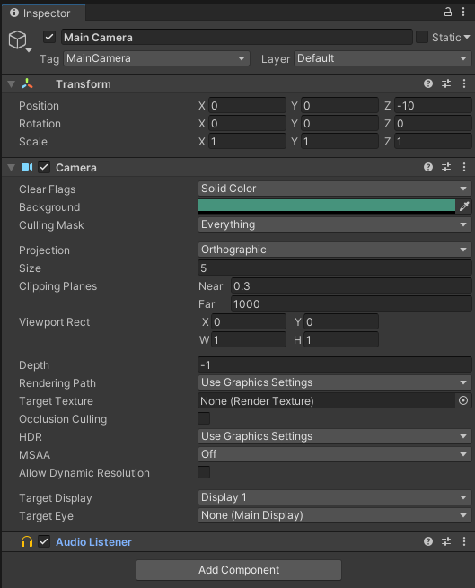

# Objetos y Componentes Básicos

> Para seguir esta parte de la teoría conviene abrir el proyecto **pt_objetos_y_componentes_básicos**.
> El proyecto está en una versión de Unity diferente, para abrirlo tendremos que reimportarlo a nuestra versión, aplica lo visto en el tema 2 para que funcione. 

## Objetos y Componentes

Los **Objetos** son un concepto clave en la creación de juegos, tanto en Unity como en otros motores. Los objetos de los que hablamos son los que nos aparecen listados en la ventana *Hierarchy*. Estos objetos, además, se identifican internamente con una clase. Hablamos de clase en el contexto de la Programación Orientada a Objetos.

> Programación Orientada a Objetos (**O**bject-**O**riented **P**rograming), en adelante OOP. 

Esta, es la clase **GameObject**.

> Si no sabemos lo que es una **Clase** lo veremos en el tema *4. Programación*.

Si seleccionamos uno de estos objetos, nos aparecerá información sobre él en la ventana *Inspector*.

Si nos fijamos, podemos ver que está dividida en 'secciones'.

Cada una de estas secciones es un **Componente**. Si seleccionamos el objeto *Main Camera*, veremos en el Inspector algo parecido a la imagen anterior. Como vemos, tenemos tres componentes. Estos son:

* Transform
* Camera
* Audio Listener

Algunos componentes tienen propiedades que podemos cambiar y otros no. Cada componente se identifica con una clase. Todas heredan de **MonoBehaviour**.

**Estos componentes son los que modelan el comportamiento de nuestro objeto**. Por ahora vamos a utilizar los componentes que nos proporciona Unity aunque el objetivo, será programar nosotros mismos nuestros propios componentes para asignárselos a objetos y que se comporten como nosotros hayamos programado.

Como vemos, hay un botón *Add Component* con el que podemos, en efecto, añadir otro componente al objeto. Este, podrá ser uno de los de Unity o uno nuestro.

> Para seguir mejor la teoría, es conveniente abrir el proyecto Unity_Basics.
> Abriremos la escena **A_coordinate_components**. Lo podemos hacer dando doble click desde la ventana Project, Assets > Scenes > A_coordinate_components .

Cada componente es diferente y es importante entender los más básicos, hay que tener en cuenta que algunos de ellos funcionan junto a otros. Esto significa que para que funcionen algunas cosas, dos componentes diferentes deben existir en los objetos correspondientes. Es el caso del 'Mesh Filter' y el 'Mesh Renderer' por ejemplo. Podemos crear un objeto 3D como un Cubo si queremos comprobarlo. Probemos a quitar uno de los dos componentes, al ejecutar el juego (o incluso en la vista de edición), veremos que no se rendriza.

> Al lado de los nombres de la mayoría de los coponentes hay un checkbox. Para no estar borrando y creando los componentes, podemos simplemente desactivar el checkbox. Esto desactivará el componente.

Si le damos a *Play* a la escena y aún no nos hemos cargado nada, veremos que hay un cubo que cae y choca contra el suelo.
Este es otro ejemplo de componentes que funcionan coordinados. Si desactivamos de alguno de los dos objetos su Box Collider y volvemos a darle a *Play*, veremos que se traspasan.

> Ojo, antes de hacer los cambios, es importante salir del *Play Mode* volviendo a darle al botón de *Play* (que estará en azul). Si no lo hacemos, los cambios que hayamos hecho no se aplicarán.

Una vez probado esto, volvamos a activar los colliders y entremos en *Play Mode* (dando al play). Debería pasar lo mismo que la primera vez, es decir debería funcionar.

Ahora, con el 'juego' corriendo, si nos fijamos veremos que estamos en la ventana de Game. Como ya vimos, esto es lo que ve el jugador. Pero nosotros no somos el jugador, podemos ir incluso con el juego ejecutándose a la pantalla de *Scene*. Desde esta, estamos viendo el juego en tiempo real, y no solo eso, podemos seguir seleccionando objetos desde la ventana Hierarchy y ver sus propiedades. Pero no solo eso, podemos editarlas. Probemos a cambiar la posición del cubo en Y.

En Transform > Position > 'Y' podemos poner 10 por ejemplo. Veremos como el cubo cambia de posición y vuelve a caer.
De igual forma podemos desactivar los Box Collider o probar cosas. Recuerda tener en cuenta que los cambios que apliquemos en *Play Mode* no se guardarán.

Ahora que ya sabemos algo más, pasemos a la escena **B_playing**. Es una escena simple con algunas cosas nuevas, la idea de esto es que investiguemos un poco y nos familiaricemos con Unity. Toca todo lo que se te ocurra e intenta entender por qué se comportan de cierta forma algunos objetos.

    Escena, Cámaras, Luces, Objetos 3D

    Prefabs

## Anexo

