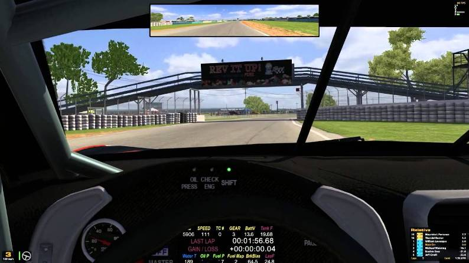

# Objetos y Componentes Básicos

> Para seguir esta parte de la teoría conviene abrir el proyecto **unity-basics**.
> El proyecto está en una versión de Unity diferente, para abrirlo tendremos que reimportarlo a nuestra versión, aplica lo visto en el tema 2 para que funcione. 

## Escenas

Una **escena** es un mundo virtual en el que podemos instanciar diferentes elementos. Los juegos se componen de escenas, en unity, al abrir un proyecto nuevo se nos crea una escena por defecto. En el proyecto que hemos abierto, hay varias en la carpeta Scenes. Podemos abrirlas haciendo doble click y se distinguen por su icono y por que su extensión es '.unity'.

## Objetos y Componentes

Los **Objetos** son un concepto clave en la creación de juegos, tanto en Unity como en otros motores. Los objetos de los que hablamos son los que nos aparecen listados en la ventana *Hierarchy*. Estos objetos, además, se identifican internamente con una clase. Hablamos de clase en el contexto de la Programación Orientada a Objetos.

> Programación Orientada a Objetos (**O**bject-**O**riented **P**rograming), en adelante OOP. 

Esta, es la clase **GameObject**.

> Si no sabemos lo que es una **Clase** lo veremos en el tema *4. Programación*.

Si seleccionamos uno de estos objetos, nos aparecerá información sobre él en la ventana *Inspector*.

Si nos fijamos, podemos ver que está dividida en 'secciones'.

Cada una de estas secciones es un **Componente**. Si seleccionamos el objeto *Main Camera*, veremos en el Inspector algo parecido a la imagen anterior. Como vemos, tenemos tres componentes. Estos son:

* Transform
* Camera
* Audio Listener

Algunos componentes tienen propiedades que podemos cambiar y otros no. Cada componente se identifica con una clase. Todas heredan de **MonoBehaviour**.

**Estos componentes son los que modelan el comportamiento de nuestro objeto**. Por ahora vamos a utilizar los componentes que nos proporciona Unity aunque el objetivo, será programar nosotros mismos nuestros propios componentes para asignárselos a objetos y que se comporten como nosotros hayamos programado.

Como vemos, hay un botón *Add Component* con el que podemos, en efecto, añadir otro componente al objeto. Este, podrá ser uno de los de Unity o uno nuestro.

> Para seguir mejor esta parte, es conveniente abrir el proyecto **unity-basics**.
> Abriremos la escena **A_coordinate_components**. Lo podemos hacer dando doble click desde la ventana Project, Assets > Scenes > A_coordinate_components .

Cada componente es diferente y es importante entender los más básicos, hay que tener en cuenta que algunos de ellos funcionan junto a otros. Esto significa que para que funcionen algunas cosas, dos componentes diferentes deben existir en los objetos correspondientes. Es el caso del 'Mesh Filter' y el 'Mesh Renderer' por ejemplo. Podemos crear un objeto 3D como un Cubo si queremos comprobarlo. Probemos a quitar uno de los dos componentes, al ejecutar el juego (o incluso en la vista de edición), veremos que no se rendriza.

> Al lado de los nombres de la mayoría de los coponentes hay un checkbox. Para no estar borrando y creando los componentes, podemos simplemente desactivar el checkbox. Esto desactivará el componente.

Si le damos a *Play* a la escena y aún no nos hemos cargado nada, veremos que hay un cubo que cae y choca contra el suelo.
Este es otro ejemplo de componentes que funcionan coordinados. Si desactivamos de alguno de los dos objetos su Box Collider y volvemos a darle a *Play*, veremos que se traspasan.

> Ojo, antes de hacer los cambios, es importante salir del *Play Mode* volviendo a darle al botón de *Play* (que estará en azul). Si no lo hacemos, los cambios que hayamos hecho no se aplicarán.

Una vez probado esto, volvamos a activar los colliders y entremos en *Play Mode* (dando al play). Debería pasar lo mismo que la primera vez, es decir debería funcionar.

Ahora, con el 'juego' corriendo, si nos fijamos veremos que estamos en la ventana de Game. Como ya vimos, esto es lo que ve el jugador. Pero nosotros no somos el jugador, podemos ir incluso con el juego ejecutándose a la pantalla de *Scene*. Desde esta, estamos viendo el juego en tiempo real, y no solo eso, podemos seguir seleccionando objetos desde la ventana Hierarchy y ver sus propiedades. Pero no solo eso, podemos editarlas. Probemos a cambiar la posición del cubo en Y.

En Transform > Position > 'Y' podemos poner 10 por ejemplo. Veremos como el cubo cambia de posición y vuelve a caer.
De igual forma podemos desactivar los Box Collider o probar cosas. Recuerda tener en cuenta que los cambios que apliquemos en *Play Mode* no se guardarán.

Ahora que ya sabemos algo más, pasemos a la escena **B_playing**. Es una escena simple con algunas cosas nuevas, la idea de esto es que investiguemos un poco y nos familiaricemos con Unity. Toca todo lo que se te ocurra e intenta entender por qué se comportan de cierta forma algunos objetos.

## Cámaras

La cámara es un objeto imprescindible en nuestra escena, los objetos se renderizan y muestran por pantalla gracias a esta. Podemos tener más de una cámara y ir cambiando o incluso renderizar lo que 'graba' una cámara en otro objeto. Veamos un ejemplo porque esto puede ser un poco lío.

Pensemos en un juego de carreras, en muchos de estos, se puede cambiar de cámara, podemos correr la carrera desde fuera del coche o desde dentro.

<table align="center">

<tr>
<th>Cámara interior</th>
<th>Cámara exterior</th>
</tr>

<tr>
<td></td>
<td></td>
</tr>

</table>

¿Y qué hay de lo de renderizar una cámara en un objeto? Pues bien en la siguiente imagen vemos que tenemos una especie de retrovisor, podemos pensar que es un espejo pero la realidad es que los espejos no son nada fáciles de hacer en los juegos, una técnica comunmente usada es simplemente tener una cámara apuntando hacia atrás y que se renderiza en este pequeño plano.

Si abrimos la tercera escena de nuestro proyecto, **C_cameras**, podemos ver algunos ejemplos de cómo usar las cámaras.

Aunque parezca sencillo, el cómo funcionan las cámaras se puede complicar bastante. Debemos conocer algunos conceptos clave, en la imagen de abajo, podemos ver un cono en 2D que forma la cámara. Las dimensiones de este cono dependerán del tamaño de la cámara y del **F**ield **O**f **V**iew o **FOV**.

A parte, tenemos los **clipping planes**, hay dos, el 'near' y el 'far', estos, de alguna forma, cortan el cono convirtiéndolo en una pirámide. Esta pirámide es lo que llamamos **frustrum** o **view frustrum**. 

> Utilizamos lenguaje especializado para que al leer documentación técnica no nos perdamos. 

Todo lo que esté fuera del view frustrum no se renderizará, es decir, no se verá en pantalla. **Un objeto que se encuentra entre la cámara y el near plane NO se verá**.

Aquí otra imagen con todos los conceptos:

Obiamente, todos estos parámetros de los que hablamos los podemos editar en el componente *Camera* de Unity.

## Objetos 3D

Un objeto 3D, a nivel interno, es un conjunto de vértices y un conjunto de aristas. Un **vértice**, podemos describirlo como un punto en el espacio que puede tener o no diferentes propiedades. Por ahora no las veremos y nos quedaremos con que un vértice es un punto en el espacio.

Una **arista** es simplemente una conexión entre dos vértices.

Con esta información, el motor de renderizado dibuja las caras del modelo 3d. Una propiedad importante que tienen nuestros objetos son los materiales, veremos un poco mejor qué son en el apartado [luces](#luces).

## Luces

Para el renderizado de escenas 3D, Unity (o cualquier motor de renderizado) tiene que convertir la información tridimensional guardada en la escena en píxeles. Esta información de la que hablamos, es obviamente todos esos vértices y aristas de todos los modelos.

La luz es lo que interactúa con las caras del modelo y acaba llegando a la cámara. Esta es un poco la idea:

El color final que obtengamos en pantalla dependerá de varios factores, entre ellos, el material del objeto o el color y intensidad de la luz.

**El material de un objeto contiene información sobre cómo interactúa la luz con este**. Propiedades como el color o la intensidad con la que refleja la luz están almacenadas aquí, podemos crear y asignar materiales a nuestros objetos 3d fácilmente en Unity.

> En nuestros motores de render, existen 3 tipos de reflejos / luces. La luz ambiente, difusa y especular. Si entendemos qué es y cómo funcionan, tendremos mucho más control sobre lo que estamos haciendo. Aquí podemos ver un pequeño vídeo que las expliaca muy brevemente. [Vídeo Luces](https://www.youtube.com/watch?v=RjA_sC4bCAM) (2 min, inglés).

En Unity contamos con varios tipos de luces, algunas alumbran en tiempo real mientras otras tienen que ser precalculadas. En la escena **D_lights** podemos ver algunas.

## Anexo

