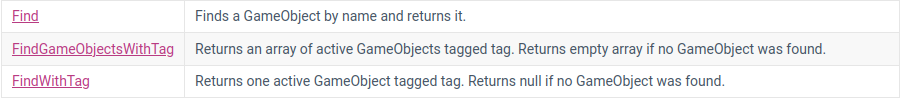

# Scripting y Eventos

En este tema vamos a ver cómo podemos interactuar con los objetos y componentes de Unity desde nuestro código y cómo crear nuestros propios componentes.

## Conceptos Básicos

En Unity tenemos dos clases básicas, por un lado la clase **GameObject**. Esta es una especie de contenedor de componentes anque además nos proporciona algunas funcionalidades. Por otra parte tenemos la clase **MonoBehaviour**, esta es la clase que utilizaremos para agregar funcionalidad a nuestros objetos.

Como sabemos, en las escenas de Unity podemos instanciar objetos. Como hemos dicho,estos no son más que un contenedor de Componentes. Si probamos a crear objetos en la jerarquía, veremos que todos tienen el componente **Transform**. Este es un componente imprescindible que contiene información posicional de nuestro objeto. No podemos tener un objeto sin este componente. Todos los otros componentes son 'opcionales', podemos añadirlos y quitarlos. Para esta introducción vamos a empezar con lo más básico, vamos a interactuar con un 'Empty Object', es decir, un 'Game Object' que solo tiene el componente Transform.

Recordemos que cada componente es una clase. En el caso del Transform podemos consultar sus características [aquí](https://docs.unity3d.com/ScriptReference/Transform.html).

Como vemos en la documentación, podemos acceder a diferentes propiedades de esta clase, por ejemplo: position, rotation, childCount o parent.

Al igual que a las propiedades, podemos acceder a métodos propios de la clase como Find, GetChild, Rotate o SetParent.

Las clases tienen muchas propiedades y métodos, obviamente no nos los vamos a aprender todos de memoria por lo que es importante saber manejar la documentación. Los nombres de los miembros suelen ser descriptivos pero de todas formas es conveniente consultar para entender exactamente qué hace y cómo se usan.

El atributo 'position' de la clase Transform, por ejemplo guarda la posición del objeto relativa a la escena, si quisiéramos en realidad la posición relativa a nuestro padre, deberíamos usar 'localPosition'.

> Recordemos que en la jerarquía podemos 'meter' objetos dentro de otros. Un objeto por tanto podrá tener 'padre' e 'hijos'. Con esto nos hacemos una idea de qué son los atributos childCount y parent así como los métodos GetChild o SetParent.
>
> Podremos movernos por la jerarquía de la escena utilizando el componente Transform.

Ahora que ya sabemos esto, veamos lo básico para interactuar con los componentes.

Lo primero que hemos de hacer es crear un script con: Clic derecho en la ventana project > Create > C# Script

Le pondremos un nombre, por ejemplo 'MiComponente'. Hemos creado un nuevo componente, ahora, igual que con los otros componentes, podemos ir a nuestro objeto vacío, y añadirle nuestro componente. Add Component > MiComponente.

Ya tenemos un objeto con nuestro componente personalizado aunque ahora mismo, 'MiComponente' no hace nada. Vamos a intentar que haga algo.

Si abrimos nuestro script veremos que tenemos una clase MiComponente que hereda de MonoBehaviour, esta es la clase de la que heredan todos nuestros componentes.

Veremos también que tiene un método Start y otro Update.

El método Start se ejecuta automáticamente cuando se instancia el objeto en la escena, el Update, se ejecuta cada frame.

Por ahora utilizaremos el Start. El objetivo va a ser que nuestro componente modifique la posición del objeto. Lo primero que necesitaremos será hacer referencia al componente Transform para poder modificar su atributo position.

Hay varias formas de hacer esto, ahora usaremos una de las funciones más útiles, la función GetComponent. Esta función nos devolverá el componente del objeto del tipo que especifiquemos. Se usa tal que así:

```C#
	Transform transform = this.GetComponent<Transform>();
```

Nuestra clase MiComponente está en un GameObject en concreto. La función GetComponent buscará un componente en este caso del tipo Transform en este GameObject.

Si no lo encuentra devolverá null.

En este caso sabemos que el componente Transform existe porque es obligatorio pero para otros componentes tendremos que asegurarnos de que los hayamos añadido.

Ahora sí, podemos acceder a la posición del objeto. Podemos hacer que la función Start nos quede tal que:

```C#
	void Start() {

		Transform transformComponent = this.GetComponent<Transform>();

		// Debug.Log(string s) -> Esta función se utiliza para escribir en la consola de Unity
		Debug.Log("Mi posición original es: " + transformComponent.position.ToString());

		transformComponent.position = new Vector3(5, 10, 6);

		Debug.Log("Y ahora mi posición es: " + transformComponent.position.ToString());

	}
```

> Este código funciona para 2D y 3D.

Ahora ya tenemos un componente que hace algo. Podemos probarlo dando al botón play. Como tenemos un objeto vacío no veremos nada aunque si nos vamos a la ventana Escena y seleccionamos nuestro objeto veremos que su posición ha cambiado. En el log, deberían haber dos mensajes escritos también.

---

Esta es la idea básica para interactuar con los objetos de Unity. Aplicando estos conceptos a cualquier otro tipo de componente podemos hacer juegos enteros. Viéndolo así puede parecer un ejemplo muy sencillo, pero más adelante veremos que con estos simples conceptos podemos hacer comportamientos muy interesantes.

Lo más importante es sobre todo entender qué relación hay entre los Game Objects y los Componentes. Si esto nos queda claro nos será mucho más sencillo el resto.

Ahora que ya sabemos acceder desde un componente (o desde un game object) a componente, veamos algunos 'atajos' que tenemos.

Por ejemplo, antes hemos dicho que utilizamos la función: GetComponent<T>() para acceder a un componente desde otro. (También podemos utilizarla en un game object, después lo vemos).

```C#
	class Apuntes : MonoBehaviour {

		void Start() {
			
			Rigidbody rb = this.GetComponent<Rigidbody>();

			BoxCollider bc = GetComponent<BoxCollider>();

			// Obviamente podemos acceder a nuestros propios componentes
			MiComponente mc = GetComponent<MiComponente>();

			float intensity = GetComponent<Light>().intensity;

			GetComponent<SpriteRenderer>().color = Color.green;


			// Como ya sabemos, el componente Transform está en TODOS los GameObjects, por lo que desde un GameObject o desde sus Componentes podemos acceder:

			// 1. De la forma que hemos visto
			Transform t = this.GetComponent<Transform>();

			// 2. Utilizando un 'atajo', la propiedad transform
			Transform t = this.transform;
		}
	}

```

Ya sabemos cómo acceder a los componentes, estos, recordemos que están siempre en un Game Object. Acceder al GameObject desde ellos por lo tanto, es muy sencillo, utilizaremos la propiedad 'gameObject'.

```C#

	class Apuntes : MonoBehaviour {

		void Start() {

			// Así de facil
			GameObject go = this.gameObject;


			// Ahora podemos acceder a sus propiedades:

			// Equivalentes
			string n = go.name;
			string n = gameObject.name;

			string tag = gameObject.tag;


			// Desde el gameObject también podemos acceder al Transform
			Vector3 myPosition = gameObject.transform.position;

		}

	}

```

---

Bien, una vez visto esto, ya sabemos cómo acceder desde nuestro script a todos los componentes de mi Objeto y al propio objeto. Con esto ya tenemos mucho ganado pero a veces querremos acceder a objetos que no sean el nuestro. Para acceder a otro objeto hay tres formas. Vamos a verlas. (Obviamente si accedemos a otro objeto ya podemos acceder a cualquiera de sus compnentes.)

Las formas son las siguientes:

* Utilizando funciones FindObject.

* Guardándolo en una variable y definirlo desde el editor.

* Accediendo a él a base de la jerarquía.


### Utilizando funciones FindObject

La clase GameObject nos proporciona algunas funciones estáticas para buscar objetos por nombre o por tag. Dependiendo de la función que utilicemos nos devolverá un array de objetos o un único objeto.

Documentación:

<p align="center">

</p>

```C#

	class Apuntes : MonoBehaviour {

		void Start() {

			GameObject player = GameObject.FindWithTag("PLAYER");

			GameObject[] enemys = GameObject.FindObjectsWithTag("ENEMY");

			// Obviamente en el editor de Unity (o por código) hemos de asignarle un tag a los objetos

			// Recordad que siempre que podamos evitaremos los 'magic numbers / strings'
			// preferiblemente utilizaremos una variable para el tag

			// const string PLAYER_TAG = "PLAYER";
			// GameObject player = GameObject.FindWithTag(PLAYER_TAG);
		}

	}

```

Estas funciones facilitan bastante las cosas pero hay que saber cuándo utilizarlas, hacerlo repetidamente dentro del Update() puede ser costoso.


### Guardándolo en una variable y definirlo desde el editor

En unity podemos serializar o hacer públicos nuestros campos para poder asignarlos desde el editor.
Esto funciona tanto con variables de tipos primitivos (int, string, float, etc.) como con Componentes y Objetos Serializables.

```C#

	class Apuntes : MonoBehaviour {

		[SerializeField] // Esto es un Atributo, lo utilizaremos para que Unity nos muestre la variable en el editor.

		GameObject jugador;

		// No tenemos por qué serializar el GameObject entero, podemos hacer referéncia solo a uno de sus componentes. Al arrastrar al 'hueco' un GameObject que tenga un componente de tipo Light, se hará referencia solo a ese componente. Con esto nos podemos evitar más tarde un lightGO.GetComponent<Light>().
		[SerializeField]
		Light luz;

		// Podemos utilizar public pero es mejor práctica utilizar el atributo.
		public GameObject boss;


		void Update() {
			// Si se nos ha olvidado asignarlos desde el editor, nos dará un error. (ya que estarán a null)

			jugador.HazLoTuyo();			
			boss.TuTambien();

		}
		
	} 


```

Este método nos puede ser muy útil si en nuestro juego estamos haciendo un nivel en el que los objetos se tienen que relacionar entre si de cierta forma en concreto. Asignando manualmente las referencias podemos tener más control. 

### Accediendo a él a base de la jerarquía.

Sabemos que los GameObjects pueden tener un padre directo y *n* hijos. A estos podemos acceder utilizando el Transform. Esta clase nos proporciona métodos específicos como GetChild(int i), que nos devuelve el hijo *i*. Si tenemos una estructura muy concreta que sabemos que no va a cambiar podemos utilizar este método.

Tenemos también el método Find(string name), que busca un hijo con nombre *name*. Así existen varios métodos, es recomendable consultar la documentación.

De todas formas, lo que más solemos utilizar es la siguiente forma de acceder todos los hijos de un Transform / Objeto.

```C#

	class Apuntes : MonoBehaviour {


		void Start() {

			gameObject.name = "padre";

			// Con este bucle recorremos todos los hijos un Transform, en este caso el nuestro propio.
			foreach(Transform t in transform) {

				t.gameObject.name = "hijo";

			}
		}
	}


```

Esto se suele utilizar cuando sabemos que todos los hijos de un objeto en concreto son los que buscamos. Por ejemplo, en nuestro juego de disparos, si cada bala es un objeto, en vez de instanciarlos directamente en la escena, los instanciaremos dentro del objeto 'Balas' por ejemplo.

Con estas pocas líneas, tendremos acceso a todas las balas de forma más óptima que utilizando alguna de las funciones Find.